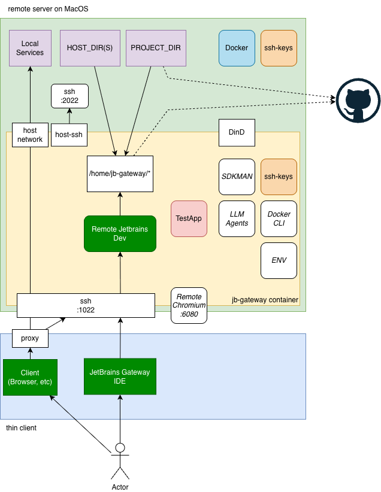

# JB Gateway: Remote Development & AI Agent Sandbox

A secure, Docker-based environment for remote development and sandboxing AI agents. This gateway provides a controlled
workspace with your projects directory mounted inside, specifically designed to limit the blast radius of AI agents and
protect your host system.

## Description



JB Gateway creates an isolated Docker container that serves as a secure boundary for both human developers and AI
agents. It is designed to:

- **Sandbox AI Agents**: Provide a restricted environment for AI agents to operate, ensuring they cannot access or
  modify files outside the designated project areas.
- **Limit Blast Radius**: Use Docker isolation to prevent accidental or malicious actions from affecting the host system
  or sensitive data.
- **Remote Development**: Connect to a consistent development environment via SSH, fully compatible with JetBrains
  Gateway.
- **Controlled Access**: Access your local projects directory inside the container while keeping the rest of your host
  system unreachable.
- **Tool-Rich Environment**: Use common development tools (git, curl, htop, telnet, jq, yq, etc.) and SDKMAN! within the
  sandbox.
- **Docker-in-Docker Capability**: Run and manage Docker services from within the isolated environment.
- **Secure Connectivity**: Persist SSH keys and provide secure tunnels for remote access.
- **OpenSpec Workflow**: Native support for the [OpenSpec](https://github.com/Fission-AI/OpenSpec) spec-driven
  development workflow, enabling AI agents to plan, design, and implement changes predictably.
- **Host Protection**: Use the `host-ssh` command for explicitly authorized connections back to the host, while
  maintaining the primary sandbox boundary.
- **Remote Visual Debugging**: Access Chrome via noVNC for web-based tools and debugging.

The current setup is optimized for:

1. Java applications with the Gradle build system
2. Running and managing Docker containers and services from within the development environment
3. The host machine is macOS

## Prerequisites

### Server-side Prerequisites

- **Docker** installed on your system
- **Bash shell**

### Client-side Prerequisites

- **Bash shell**
- **sshpass** (required for password authentication with the proxy)
    - On Ubuntu/Debian: `sudo apt-get install sshpass`
    - On macOS: `brew install hudochenkov/sshpass/sshpass`

## Quick Installation

Install jb-gateway with a single command:

### Server Installation

```bash
curl -fsSL https://raw.githubusercontent.com/asubb/jb-gateway/main/install.sh | bash -s -- --mode=server
```

### Client Installation

```bash
curl -fsSL https://raw.githubusercontent.com/asubb/jb-gateway/main/install.sh | bash -s -- --mode=client
```

### Install Both (Server + Client)

```bash
curl -fsSL https://raw.githubusercontent.com/asubb/jb-gateway/main/install.sh | bash -s -- --mode=both
```

After installation:
1. Restart your shell or run: `source ~/.bashrc` (or `~/.zshrc` for zsh)
2. Verify installation: `jbg help`
3. Update anytime with: `jbg update`

### Installation Options

- `--mode=MODE`: Installation mode (`server`, `client`, or `both`) - **required**
- `--force`: Overwrite existing installation without prompting
- `--help`: Show installation help

**Environment Variables:**

- `JBG_BRANCH`: Branch to install from (default: `main`)

**Examples:**

```bash
# Force reinstall server components
curl -fsSL https://raw.githubusercontent.com/asubb/jb-gateway/main/install.sh | bash -s -- --mode=server --force

# Add client components to existing server installation
curl -fsSL https://raw.githubusercontent.com/asubb/jb-gateway/main/install.sh | bash -s -- --mode=client

# Install from a different branch (e.g., develop)
curl -fsSL https://raw.githubusercontent.com/asubb/jb-gateway/develop/install.sh | JBG_BRANCH=develop bash -s -- --mode=server

# Install from a feature branch
curl -fsSL https://raw.githubusercontent.com/asubb/jb-gateway/feature-xyz/install.sh | JBG_BRANCH=feature-xyz bash -s -- --mode=both
```

**Note:** When installing from a non-main branch, make sure to use the same branch name in both the URL and the `JBG_BRANCH` environment variable. Updates via `jbg update` will automatically use the same branch.

### Manual Installation

If you prefer manual installation:

1. Clone this repository:
   ```shell
   git clone https://github.com/asubb/jb-gateway
   cd jb-gateway
   ```

2. Build the Docker image:
   ```shell
   ./server/build.sh
    ```

## jbg Command-Line Tool

After installation, the `jbg` command provides a unified interface for managing jb-gateway:

### Available Commands

```bash
jbg update              # Update jb-gateway to the latest version
jbg server              # Server operations (coming soon)
jbg client              # Client operations (coming soon)
jbg help                # Show help message
```

### Examples

```bash
# Update your installation
jbg update

# View available commands
jbg help

# Server commands (planned)
jbg server start        # Start the server container
jbg server stop         # Stop the server container
jbg server status       # Check server status

# Client commands (planned)
jbg client status       # Check client connection status
jbg client proxy        # Manage proxy tunnels
```

### Update Command

The `jbg update` command keeps your installation current:

- **Git-based installations**: Uses `git pull` for fast updates
- **Non-git installations**: Re-downloads files from GitHub
- **Mode preservation**: Maintains your installation mode (server/client/both)
- **Branch preservation**: Updates from the same branch you originally installed from
- **Safe updates**: Creates backups before updating

The update command automatically remembers which branch you installed from and pulls updates from that same branch. This ensures consistency and allows you to track development branches.

### Manual Shell Integration

If you installed for an unsupported shell or need to manually configure:

Add this line to your shell's RC file (`.bashrc`, `.zshrc`, etc.):

```bash
[ -f "$HOME/.jb-gateway/bin/env.sh" ] && source "$HOME/.jb-gateway/bin/env.sh"
```

### Troubleshooting

**Command not found after installation:**
- Restart your shell or run: `source ~/.bashrc` (or `~/.zshrc` for zsh)
- Verify PATH includes `$HOME/.jb-gateway/bin`

**Installation fails with network errors:**
- Check your internet connection
- The installer retries up to 3 times with exponential backoff
- For persistent issues, try manual installation from the cloned repository

**Existing installation conflicts:**
- Use `--force` flag to overwrite: `... | bash -s -- --mode=server --force`
- Or manually remove `$HOME/.jb-gateway` before reinstalling

**Update issues:**
- If git pull fails, the updater falls back to re-downloading files
- Check `$HOME/.jb-gateway/bin/.install-mode` to verify your installation mode

## Usage

This project is divided into two parts: the **server** (where the Docker container runs) and the **client** (how you
connect to it and use its services).

### Server-side Usage (Host where Docker runs)

#### 1. Build the Docker image

```bash
./server/build.sh
```

#### 2. Start the container

```bash
./server/run.sh
```

By default, this mounts `~/projects` from your host to `/home/jb-gateway/projects` in the container.

#### 3. Stop the container

```bash
./server/stop.sh
```

### Client-side Usage (Connecting to the Gateway)

#### 1. Connecting via SSH

You can connect to the container using standard SSH:

```bash
ssh -p 1022 jb-gateway@localhost
```

* **Username**: `jb-gateway`
* **Password**: `password`

#### 2. Using with JetBrains Gateway

1. Open JetBrains Gateway.
2. Select **Connect to SSH**.
3. Use `localhost` on port `1022`, username `jb-gateway`, password `password`.
4. Open your project from `/home/jb-gateway/projects/`.

#### 3. Accessing Remote Chrome (noVNC)

Open your web browser and navigate to:

```
http://localhost:6080/vnc.html
```

Click **Connect** to see the remote desktop.

#### 4. Accessing Files via SMB

You can mount the projects directory as a network share:

- **macOS**: `smb://localhost/projects`
- **Windows**: `\\localhost\projects`
- **Credentials**: Username `jb-gateway`, Password `password`

---

## Detailed Features & Configuration

### Container Configuration (host.env)

You can customize the container environment by creating a `host.env` file in the `server/` directory.

A template file `host.env.example` is provided as a reference. Copy it to `host.env` and customize as needed:

```bash
cp server/host.env.example server/host.env
```

Key configuration options:

- `PROJECTS_DIR`: The projects directory to mount (defaults to `~/projects`).
- `HOST_DIRS`: Additional directories to mount (format: `/host/path:/container/path`).
- `CONTAINER_ENV`: Global environment variables to set in the container.
- `DISABLE_HOST_SSH`: Set to `true` to disable the back-tunnel SSH server on macOS.

---

### SDK Management with SDKMAN!

The container comes with [SDKMAN!](https://sdkman.io/) pre-installed for the `jb-gateway` user. This allows you to
easily install and switch between different versions of Java, Gradle, Maven, and other SDKs.

### Common SDKMAN! Commands:

- List available Java versions: `sdk list java`
- Install a specific Java version: `sdk install java 17.0.7-tem`
- Switch Java version: `sdk use java 17.0.7-tem`
- Set default Java version: `sdk default java 17.0.7-tem`

Note: SDKMAN! is initialized in the `.bashrc` of the `jb-gateway` user, so it's available in any new SSH session.

## Docker-in-Docker

The container includes the Docker CLI and is configured to connect to the host's Docker daemon. This means you can run
Docker commands (like `docker ps`, `docker build`, etc.) from within the JB Gateway container, and they will affect the
Docker environment on your host machine.

### Accessing Services on the Host

When you run services via Docker from within the container (or if they are already running on the host), they are
executed on the host's Docker daemon. To access these services from within the JB Gateway container, you must use
`host.docker.internal` instead of `localhost`.

For example, if you start a Postgres database on port 5432:

```bash
# Inside JB Gateway container
docker run --name some-postgres -e POSTGRES_PASSWORD=mysecretpassword -p 5432:5432 -d postgres
```

To access it from within the JB Gateway container (e.g., using `psql`), use `host.docker.internal:5432`.

## OpenSpec with Claude Agent

OpenSpec is a spec-driven development workflow that helps AI agents understand and implement changes predictably.

### Step 1: Initialize OpenSpec

If your project doesn't have OpenSpec initialized yet, navigate to your project root and run:

```bash
openspec init
```

During init, you'll be prompted to pick your AI tool. Select **Claude** to ensure the project is configured for Claude
Agent. This generates the native slash commands for the OpenSpec workflow:

- `.claude/commands/opsx/` — native slash commands for the OpenSpec workflow

Note: You should also ensure the following context files exist or create them if they are missing:

- `openspec/project.md` — your project context doc
- `openspec/AGENTS.md` — the instructions for the AI agent (the "README for Robots")

### Step 2: Fill out project.md

Use the `/opsx:onboard` command or give Claude this prompt to auto-fill the project context file:

> "Introspect my current project and fill out openspec/project.md"

This typically produces a concise markdown file with comprehensive project details — tech stack, conventions, structure.

### Step 3: The OpenSpec workflow with Claude

Claude supports native slash commands for the OpenSpec workflow:

| OpenSpec command | Description                                                            |
|:-----------------|:-----------------------------------------------------------------------|
| `/opsx:new`      | Start a new change                                                     |
| `/opsx:ff`       | Fast-forward this change — generate proposal, specs, design, and tasks |
| `/opsx:apply`    | Implement all tasks in the current change                              |
| `/opsx:archive`  | Archive the completed change and update the specs directory            |
| `/opsx:explore`  | Enter explore mode to think through ideas and clarify requirements     |

### Practical tips

- **Kotlin/Spring projects**: You can supplement `openspec/AGENTS.md` with Kotlin/Spring-specific guidelines (naming
  conventions, package structure, `@Transactional` usage, etc.).
- **Claude Capabilities**: Claude can run code, execute terminal commands, and work with the file system, handling all
  file creation and task execution required by OpenSpec.

## Connecting back to the Host

When running on macOS, a standalone SSH server is started on the host (port 2022). This allows the container to connect
back to your host machine easily.

### The `host-ssh` Command

Inside the container, you can use the `host-ssh` command to quickly start an SSH session back to your host machine:

```bash
host-ssh
```

This is particularly useful if you need to run commands on your host machine while working inside the container.

## Security Note

This container is intended for development purposes only and is not secured for production use. The default password is
hardcoded and SSH root login is enabled.

### Using the HTTP Proxy (client/proxy.sh)

JB Gateway includes a proxy feature that allows you to forward HTTP requests from your local machine to the remote host
via the gateway container. This is useful when you need to access services running on the remote host network.

### Configuring Ports

You can configure which ports to tunnel in two ways:

1. Using a `.env` file in `client/` (recommended for multiple ports):
   ```
   # client/.env file example
   PROXY_PORTS=8080,8081,8082-8085

   # Optional SSH settings
   SSH_PORT=1022
   SSH_USER=jb-gateway
   SSH_HOST=localhost
   SSH_PASSWORD=password
   ```

2. Using command-line arguments (for quick, one-time tunneling):
   ```bash
   ./client/proxy.sh -p 8080,8081,8082-8085
   ```

The port specification supports:

- Individual ports: `8080,8081,8082`
- Port ranges: `8082-8085` (equivalent to 8082,8083,8084,8085)
- Combinations: `8080,8081,8082-8085`

### Starting the Proxy

Run the proxy with:

```bash
./client/proxy.sh [options]
```

Options:

- `-p, --ports PORTS`: Comma-separated list of ports or port ranges to tunnel
- `-s, --ssh-port PORT`: SSH port for jb-gateway container (default: from .env or 1022)
- `-u, --user USER`: SSH user for jb-gateway container (default: from .env or jb-gateway)
- `-w, --password PASS`: SSH password for jb-gateway container (default: from .env or none)
- `-h, --help`: Show help message

Example:

```bash
./client/proxy.sh -p 8080,8081,8082-8085
```

With password:

```bash
./client/proxy.sh -p 8080,8081,8082-8085 -w password
```

This will set up tunnels for ports 8080, 8081, 8082, 8083, 8084, and 8085, forwarding each port from your local machine
to the same port on the remote host via the jb-gateway container.

The proxy script automatically checks if tunnels are already running for the specified ports:

- If a tunnel is already running for a port, it will be skipped (verified by both PID and process details)
- If a process with the saved PID exists but is not actually a tunnel for the specific port, a new tunnel will be
  started
- If a stale PID file is found (process not running), a new tunnel will be started
- Only ports without active tunnels will have new tunnels created

This allows you to run the proxy script multiple times without creating duplicate tunnels, and ensures that only the
necessary tunnels are started.

All tunnels run in the background, allowing you to continue using your terminal.

### Stopping the Proxy

To stop all running proxy tunnels:

```bash
./client/proxy-stop.sh
```

This will terminate all proxy tunnels that were started by the proxy.sh script.

### Proxy Logs

The proxy system creates several types of log files for easier troubleshooting:

1. **Main proxy script logs**:
   All output from the proxy.sh script (now in `client/proxy.sh`) is redirected to a log file:
   ```
   ~/.jb-gateway/logs/proxy_YYYYMMDD_HHMMSS.log
   ```

2. **Individual tunnel logs**:
   Each tunnel has its own dedicated log file:
   ```
   ~/.jb-gateway/logs/tunnel_PORT_YYYYMMDD_HHMMSS.log
   ```
   Where `PORT` is the port number being tunneled.

3. **Proxy stop script logs**:
   Output from the proxy-stop.sh script (now in `client/proxy-stop.sh`) is also logged:
   ```
   ~/.jb-gateway/logs/proxy-stop_YYYYMMDD_HHMMSS.log
   ```

In all cases, `YYYYMMDD_HHMMSS` is the timestamp when the respective script was started.

The main script output is also displayed in the terminal while the scripts run, but having logs saved to files makes it
easier to debug issues that might occur while tunnels are running in the background. The individual tunnel logs are
particularly useful for troubleshooting connection issues with specific ports.

### SMB Sharing Details

JB Gateway includes SMB (Samba) file sharing capabilities, allowing you to access your projects directory over the
network from other devices.

### Accessing Shared Folders

The container shares the projects directory via SMB with the following details:

- **Share Name**: projects
- **Server Address**: Your host machine's IP address
- **Ports**: 139, 445 (standard SMB ports)
- **Username**: jb-gateway
- **Password**: password

#### From Windows

1. Open File Explorer
2. In the address bar, type `\\your-host-ip\projects` (replace `your-host-ip` with your host machine's IP address)
3. When prompted, enter the username `jb-gateway` and password `password`

#### From macOS

1. In Finder, select "Go" > "Connect to Server..."
2. Enter `smb://your-host-ip/projects` (replace `your-host-ip` with your host machine's IP address)
3. When prompted, enter the username `jb-gateway` and password `password`

#### From Linux

1. Open your file manager
2. Connect to server with the address `smb://your-host-ip/projects` (replace `your-host-ip` with your host machine's IP
   address)
3. When prompted, enter the username `jb-gateway` and password `password`

Alternatively, you can mount the share using the command line:

```bash
sudo mount -t cifs //your-host-ip/projects /mnt/projects -o username=jb-gateway,password=password
```

#### Using the `client/smb-connect.sh` Script

JB Gateway includes a convenient script for viewing and mounting SMB shares from the command line:

```bash
./client/smb-connect.sh
```

#### Viewing Available Shares

To view all available shares on the JB Gateway container:

```bash
./client/smb-connect.sh view
```

This will display a list of all available shares, including the default "projects" share.

You can also view shares on a specific host by providing the hostname or IP address:

```bash
./client/smb-connect.sh view 192.168.1.100
```

#### Mounting Shares

To mount a share to a local directory:

```bash
./client/smb-connect.sh mount <share> <mountpoint>
```

For example, to mount the "projects" share to a directory called "smb-mount" in your home directory:

```bash
./client/smb-connect.sh mount projects ~/smb-mount
```

You can also mount a share from a specific host by providing the hostname or IP address:

```bash
./client/smb-connect.sh mount projects ~/smb-mount 192.168.1.100
```

The script will automatically create the mount point directory if it doesn't exist.

### Remote Chrome Access Details

The container includes a remote Chrome instance that can be accessed via a web browser using noVNC.

#### How to Access

1. Ensure the container is running.
2. Open your web browser and navigate to:
   ```
   http://localhost:6080/vnc.html
   ```
3. Click "Connect".
4. You will see a Fluxbox desktop environment with Chromium running.

This is useful for debugging web applications or accessing web-based tools from within the container's network
environment.

#### Configuration

- **Port**: 6080 (noVNC)
- **VNC Port**: 5900 (Internal)
- **Chromium Debug Port**: 9222
- **Display**: :1
- **Screen Resolution**: 1920x1080x24

### SMB Configuration

The script reads configuration from `client/.env` or `server/host.env` files if they exist. You can customize the
following
parameters:

- `SMB_HOST`: The default hostname or IP address of the SMB server (default: localhost)
- `SMB_USER`: The username for authentication (default: jb-gateway)
- `SMB_PASSWORD`: The password for authentication (default: password)

You can override the default host by specifying a host directly in the command line.

### Security Note

The SMB share is protected with the same credentials as the SSH access. For production environments, consider changing
the default password.

## Known Issues

- If you experience any persistent issues with the cache, you can reset the cache volume:
    ```bash
    docker stop jb-gateway
    docker volume rm jb-gateway-cache
    ./server/run.sh
    ```
